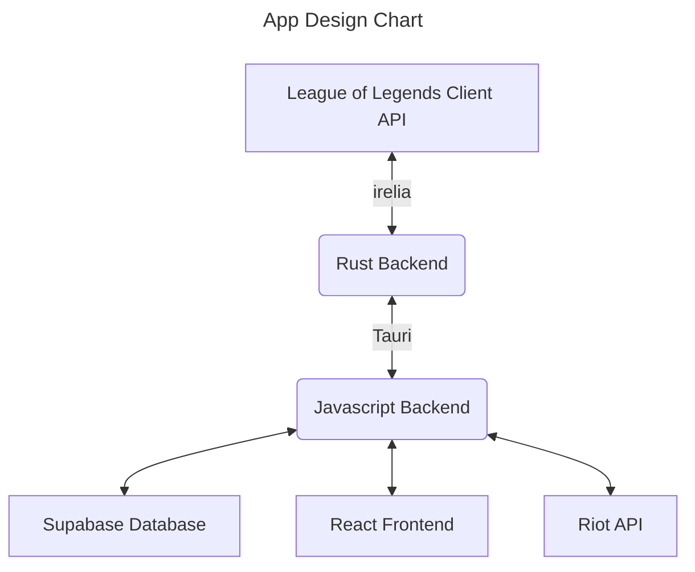
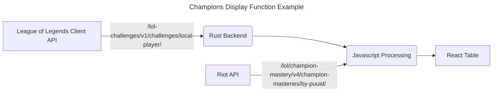

# Crystal

warning: this app will run with reduced functionality if you compile it yourself since there is compile-time secrets for function authentication that are not included in this repo, to stop malicious actors from modifying the database. THIS IS SO THAT USERS ARE NOT REQUIRED TO CREATE AN ACCOUNT TO USE IT

desktop client to help you keep track of your league challenges! screenshots incoming

uses tauri with rust and react, typescript, and shadcn/ui with tailwind

special thanks to sylv for help with [irelia](https://github.com/AlsoSylv/irelia)

## Changelog

0.4.0
- added skin tracker
- added authentication to supabase functions
- minor ui tweaks

0.3.0
- added custom status
- added challenge icon editor
- added tooltips to homepage challenge icons

0.2.0
- added functionality to automatically track available champions in aram and crowd favorites for arena and display relevant challenge progress

0.1.0
- initial release
