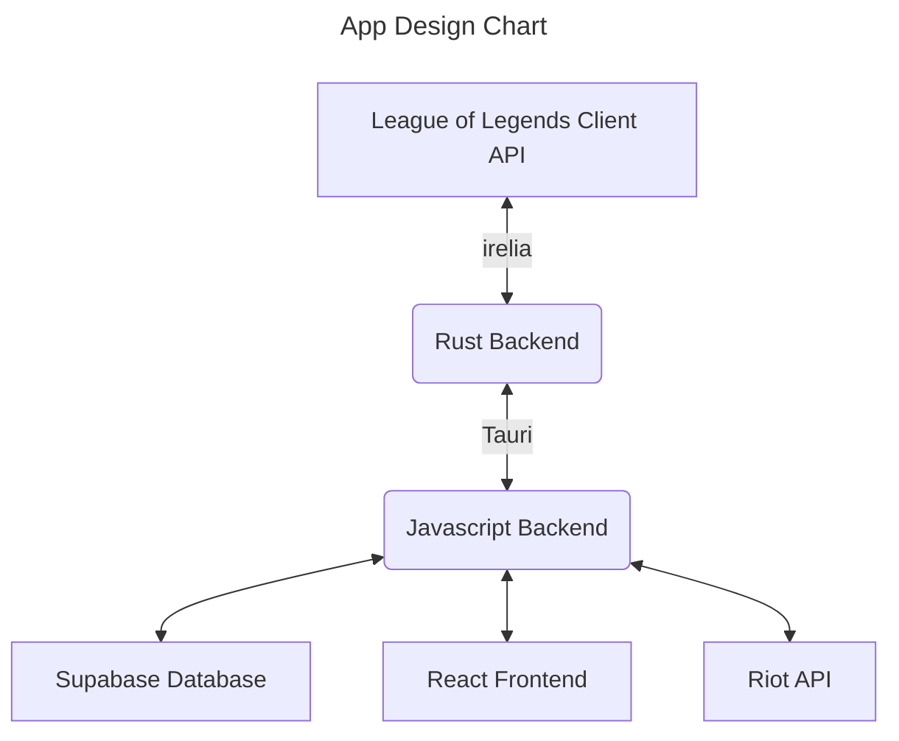
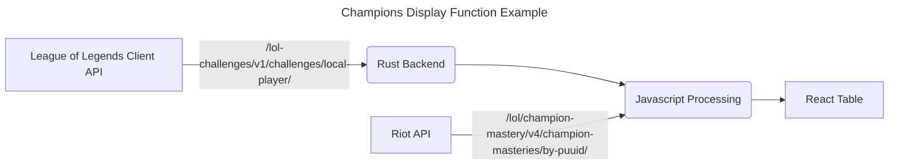
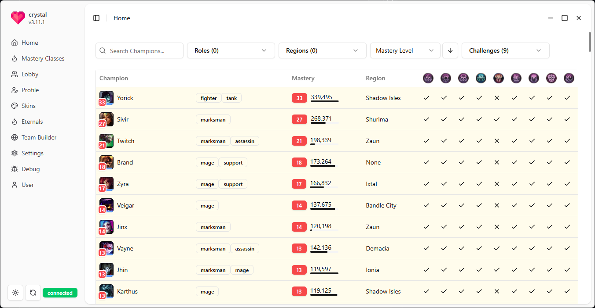
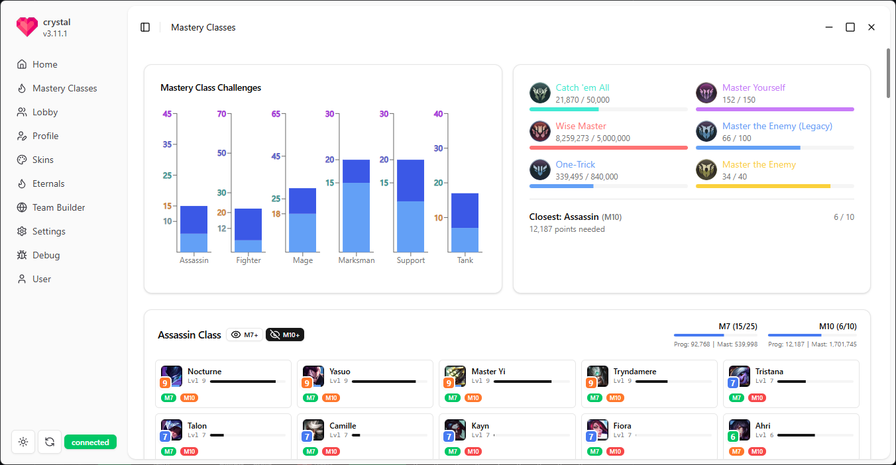
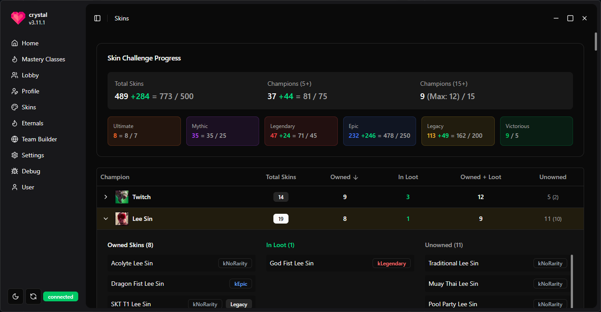
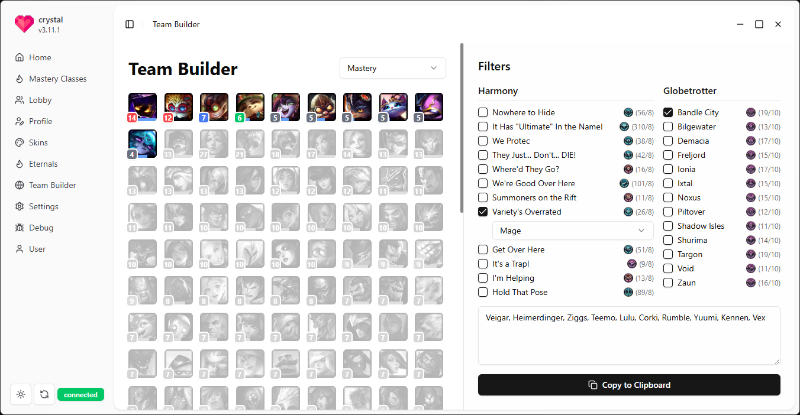

# Crystal

warning: this app won't update mastery points in real time if you compile it
yourself since there is a compile-time secret for function authentication that
are not included in this repo, to stop malicious actors from modifying the
database. this will be removed later once user's are required to log in via RSO
(almost no effort to the user)

desktop client to help you keep track of your league challenges! screenshots
incoming

uses tauri with rust and react, typescript, and shadcn/ui with tailwind

special thanks to sylv for help with
[irelia](https://github.com/AlsoSylv/irelia)

Crystal isn't endorsed by Riot Games and doesn't reflect the views or opinions
of Riot Games or anyone officially involved in producing or managing Riot Games
properties. Riot Games, and all associated properties are trademarks or
registered trademarks of Riot Games, Inc.

  
